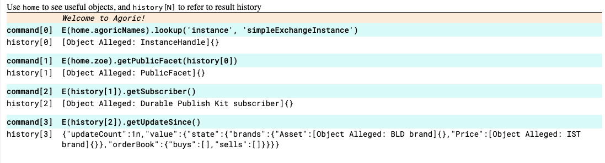

# SimpleExchange dApp tutorial

## Description

This tutorial showcases how to interact with the SimpleExchange dApp in a local environment, as well as how to deploy the contract in the Agoric Devnet.

The tutorial page is structured as follows:

- Pre-requisites
- Contract Testing
  - Unit tests
  - Integration tests
  - Smoke tests
  - Swingset tests
- Contract Deployment
- Launch UI

## Prerequisites

- Follow the [installing the Agoric SDK](https://docs.agoric.com/guides/getting-started/) guide to install the Agoric Software Development Kit (SDK);
  - Important: instead of using the community-dev branch, you need to check out the following revision: `92b6cd72484079b0349d8ccfa4510aeb820e8d67`, which is the one used on [Devnet](https://devnet.agoric.net/) at the moment that this component was developed.

```shell
go version # go version go1.20.6 darwin/arm64
node --version # v18.18.0
npm --version # 9.8.1
yarn --version # 1.22.5

# inside agoric-sdk folder
`git checkout 92b6cd72484079b0349d8ccfa4510aeb820e8d67`
yarn install && yarn build
agoric --version # 0.21.2-u11.0
```

- Clone the [SimpleExchange repository](https://github.com/alexanderem49/simple-exchange) and install the Agoric dependencies by running the following commands:

```shell
cd simple-exchange/contract
agoric install
```

## Contract Testing

### Unit tests

We covered the most important cases in unit tests, making sure that the exchange contract works as expected.
The testing framework used is [Ava](https://github.com/avajs/ava), and we build a set of [tools](../contract/test/tools/) that make the testing environment cleaner and easier to scale.

We include 2 versions of unit tests, one for the basic and the other for the upgradable version of the contract. Both of them contain the exact same test cases, but each of them reflects the difference when deploying, configuring, and communicating with the durable and non-durable contract versions :
- `./contract/test/unitTests/test-simpleExchange.js`
- `./contract/test/unitTests/test-upgradableSimpleExchange.js`

Unit tests include the following test cases:
- make sell offer - check that the contract properly handles incoming sell offer
- make buy offer - check that the contract properly handles incoming buy offer
- make trade - check that the contract properly executes the exchange when sell and buy offers can satisfy each other
- make offer with wrong issuers - check that offer with the wrong issuer fails
- make offer with offerProposal missing attribute - check that offer with wrong offerProposal attributes fails
- make offer without offerProposal - check that offer without offerProposal fails
- offers with null or invalid shapes on the proposals - check with different invalid shapes set that each of them fails
- make offer with NFT - check that NFTs can be traded on the exchange properly
- make offer with misplaced issuers - check if the contract refuses an order with a mismatch in the keyword-issuer pair
- make trade with surplus assets in Alice's payout - check if the contract returns the expected surplus when an exchange is done

To run unit tests, just run the following command:

```shell
cd simple-exchange/contract
yarn unit-test-basic
yarn unit-test-upgradable
```

This will run all test cases in each file. You will see a lot of debug console logs from Agoric SDK, including some errors - these errors are triggered by unit tests to assert the failing branches. In total 16 unit tests should pass, 8 tests for basic contract and 8 tests for durable contract.

### Integration tests

The integration test is setting up a testing environment with 2 different smart wallets and checks that simpleExchange contract can execute a successful exchange.
In order to run unit tests, follow these [instructions](../contract/test/integrationTests/README.md) and then run this command:

```shell
cd simple-exchange/contract
yarn integration-test
```

### Swingset tests

The swingset tests are meant to check that simpleExchange contract upgradeability works as expected. In this case, it means that the orderBook state and the subscriber object survive a contract upgrade.

The swingset test includes 3 test cases:
- null-upgrade - check that the contract null-upgrade is executed successfully
- null-upgrade-orderBook - check that the upgrade is executed successfully and the order book is preserved
- null-upgrade-exchange - check that the contract can execute a match an order made before the upgrade with one made after it.

To run Swingset tests, just run the following command:

```shell
cd simple-exchange/contract
yarn swingset-test
```

### Smoke tests

The smoke tests intend to build the core-eval and deploy the simpleExchange contract in a local chain, and interact with it using shell scripts.

#### Launch local chain and client

Open a new terminal and run these commands:

```shell
cd agoric-sdk/packages/inter-protocol/scripts
./start-local-chain.sh
```

If you get the following error message `FATAL ERROR:  listen EADDRINUSE: address already in use :::9464`, stop the process and execute the following commands:

```shell
lsof -i :9464
kill <PID>
```

In a second terminal run these commands:

```shell
cd agoric-sdk/packages/cosmic-swingset
make SOLO_COINS='13000000ubld,12345000000000uist,1122000000ibc/toyusdc' scenario2-run-client
```

#### Submit core-eval

For this section, the first step is to make sure that the `SDK_ROOT` path, in the [Makefile](../contract/Makefile) is pointing to your agoric-sdk.  
If so, open a third terminal and run these commands:

```shell
cd simple-exchange/contract
make bundle-contract
```

Note: your terminal will print a message similar to the one below, make sure to copy the bundle IDs (`b1-265...e54.json` and `b1-60f...509.json`) and update the [Makefile](../contract/Makefile) variables `CONTRACT_REF_BUNDLE_ID` and `MANIFEST_REF_BUNDLE_ID` respectively.

```
...
Remember to install bundles before submitting the proposal:
  agd tx swingset install-bundle @/Users/jorgelopes/Documents/GitHub/Agoric/bytepitch-bounties/simple-exchange/contract/cache/b1-180be6a3be174c957d853e862801c3643a2897ef3e96993507fe6a02ad57d33806754bf2bc73bb2664f8536861e42d46139971f9cc85724abed9408ba1b57e8a.json
  agd tx swingset install-bundle @/Users/jorgelopes/Documents/GitHub/Agoric/bytepitch-bounties/simple-exchange/contract/cache/b1-b2bb6209e466d1d7298523776513ce11c57c2eef47e52e050b5f40c2e056a03ae350c2328ad05b748ae8ee503e94c4b9ebf974aea3202643d0c7377bbe582aea.json
```

After making the adjustments mentioned above, run the following command in the same terminal:

```shell
make submit-core-eval
```

Now you should see the success message in the chain logs, and also, be able to query the contract instance in the agoricNames.
Note that if you plan to execute this command more than once, you need to overwrite the variable `VOTE_PROPOSAL` accordingly.

#### Run smoke tests

Before executing the offer scripts, it is necessary to update the assets and reference lists with the respective board IDs, for that run the following commands:

```shell
cd simple-exchange/contract/test/smokeTests/
agoric deploy updateAssetList
agoric deploy updateReferenceList
```

After completing the process above, you can now make sell and buy orders by running each of the following scripts:

```shell
cd simple-exchange/contract/test/smokeTests/
./sellOffer.sh
./buyOffer.sh
```

#### Verify order book

There are 2 methods to easily query the contract state of the order book:

1. Agoric Wallet REPL
   - get instance from agoricNames
   - get publicFacet
   - get subscriber
   - get updated state



2. [Storage Viewer](https://p2p-org.github.io/p2p-agoric-vstorage-viewer/#http://localhost:26657||)
   - load published children's keys
   - load simpleExchange data

## Contract Deployment

This chapter contains code and instructions for submitting a [`swingset.CoreEval`](https://docs.agoric.com/guides/coreeval/) proposal to add the simpleExchange dApp to the Agoric Devnet.

The build the core-eval it was required to first prepare the [simpleExchange-proposal](../contract/src/proposal/simpleExchange-proposal.js) and [proposalBuilder-script](../contract/src/proposal/proposalBuilder-script.js). A [Makefile](../Makefile) was also built to facilitate the process of deploying the contract.

### Bundle the contract

Open a new terminal and run the following commands:

```shell
cd simple-exchange/contract
make bundle-contract
```

This target will generate the [startSimpleExchange](../startSimpleExchange.js) and [startSimpleExchange-permit](../startSimpleExchange-permit.json) files in the project root, as well as the `contract` and `manifest` [bundles](../cache/).

Note: your terminal will print a message similar to the one below, make sure to copy the bundle IDs (`b1-265...e54.json` and `b1-60f...509.json`) and update the [Makefile](../contract/Makefile) variables `CONTRACT_REF_BUNDLE_ID` and `MANIFEST_REF_BUNDLE_ID` respectively.  
See [Smoke tests](#submit-core-eval) for more details


### Setup wallet

One wallet is needed for submitting the proposal, for that you can run the following command on the terminal:

```shell
agd keys add gov
```

Set up a smart-wallet and request funds at the [devnet faucet](https://devnet.faucet.agoric.net/), using the address from the previous step.

### Install bundles

To install the bundles follow these instructions in the same terminal as above

```shell
make install-bundles-dev
```

Verify the bundle deployment by running the following command:

```shell
agd query vstorage data bundles --node='https://devnet.rpc.agoric.net:443' --chain-id='agoricdev-23'
```

### Submit proposal

The next step is to submit the proposal, to do that run the following command:

```shell
make submit-proposal-dev
```

Verify that the proposal was submitted by running the following command:

```shell
agd query gov proposals --node='https://devnet.rpc.agoric.net:443' --chain-id='agoricdev-23' --output json | jq -c '.proposals[] | [.proposal_id,.voting_end_time,.status]';
```

You can also follow the state of your proposal on the [ Agoric devnet explorer](https://devnet.explorer.agoric.net/agoric/gov).

### Get the proposal approved

To deploy a contract on devnet, the proposal needs to pass the voting stage. So it is advised to inform the community on the devnet channel on [Agoric discord](https://discord.com/channels/585576150827532298/766738012380856343) in advance, that you plan to submit a proposal, so they can vote on it.

### Useful source of information

- [Permissioned Contract Deployment](https://docs.agoric.com/guides/coreeval/)
- [agoric-vault-collateral-proposal](https://github.com/0xpatrickdev/agoric-vault-collateral-proposal/tree/main)
- [discussion #8087](https://github.com/Agoric/agoric-sdk/discussions/8087#discussioncomment-6534378)

## Launch UI

To launch the simpleExhanghe UI the first step is to update the RPC address and chain ID according to where the contract was deployed.
At the [store.js file](todo), line 5, update the `rpcAddr` and `chainId` passed to the `makeAgoricChainStorageWatcher`.

If you wish to run the application on:

- local chain - `('http://localhost:26657', 'agoriclocal')`
- devnet - `('https://devnet.rpc.agoric.net:443', 'agoricdev-23')`

Then, open a new terminal and run the following commands:

```shell
cd simple-exchange/ui
yarn
yarn run dev
```

Now, you can open your browser and go to http://localhost:5173/#trade
